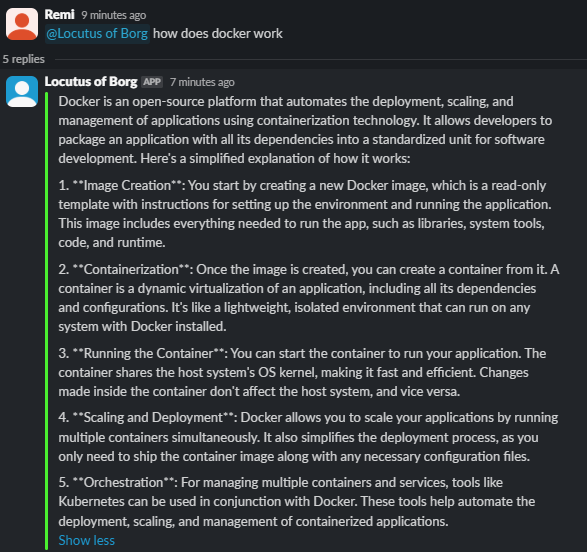

# Locutus
An AI powered slackbot.

### Idea
- A slackbot running an LLM trained on your documentation + code that is there to provide technical support with the knowledge of how your product work. While it is a nice idea, it is hard (IE expensive) to train LLMs on data. So this implementation uses an off the shelf LLM to do a proof of concept.

### Set Up
 1. Will need Ollama downloaded for this to run. [Download it here](https://ollama.com/)
 2. Clone this repo
 3. Add your `SLACK_AUTH_TOKEN`, `SLACK_CHANNEL_ID`, AND `SLACK_APP_TOKEN` to the `.env` file
    - You will need to add a new slackbot to your slack workspace with the correct permissions [see here](https://www.bacancytechnology.com/blog/develop-slack-bot-using-golang)
 4. Download the model you want to run from Ollama
 5. Update line 50 in main.go with the model you wish to run
 6. cd into the repo and run the main file `go run main.go`
 7. interact with the slackbot by `@<bot name>` in your lack channel

### Example

